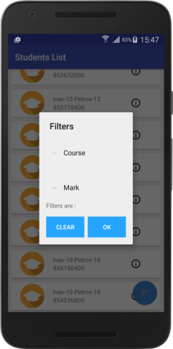
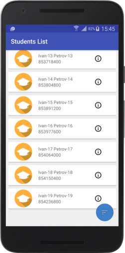

# Task_Digital Distribution Applications
Application load from server list of students and save it to Database. User can filter students by course and mark.

##Used technologies (libraries & frameworks)
###MVP 
Architecture of all app. Used with RxAndroid.
###ButterKnife
All views binds with ButterKnife 8.4.0
###Retrofit 2
Retrofit used to server query, it used with RxAndroid.
###Dagger 2
Objects creats with dagger in ApplicationModule.
###RxAndroid
All queries to server or database made with Rx. All query have own UseCase, which handle all lifecycle of query.

##Screenshots
###List of students - RecyclerView

###Students course info
#### You can see all students marks

###Filtering students
#### Filter them by course and mark. And you will see students which with mark X by Course-Y

###Upload more
#### Just pull to upload more students

